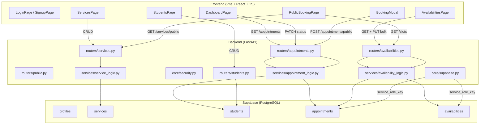
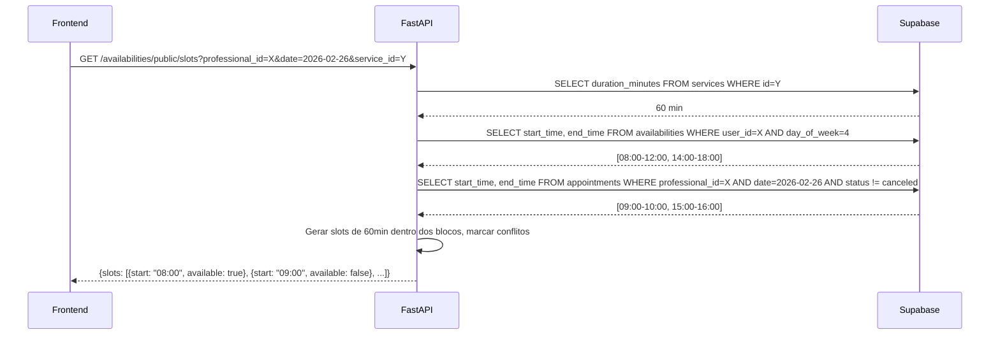

# AgendaPro — Auditoria Técnica Completa v2

**Data**: 24/02/2026 | **Commit atual**: `487bd85` | **Branch**: `main`  
**Stack**: React 18 + TypeScript + Vite | FastAPI + Supabase (PostgreSQL) | Docker Compose

---

## 1. Arquitetura Geral



---

## 2. Backend (FastAPI)

### 2.1 Estrutura de Arquivos

```
backend/app/
├── main.py                          # Entrypoint, registra todos os routers
├── core/
│   ├── config.py                    # Settings via Pydantic (lê .env)
│   ├── security.py                  # JWT dual HS256/ES256 + JWKS cache
│   ├── dependencies.py              # get_current_user, get_supabase_client
│   ├── supabase.py                  # supabase (anon) + supabase_admin (service_role)
│   └── google_config.py             # Google OAuth config
├── routers/
│   ├── services.py                  # CRUD + GET /public/:id
│   ├── appointments.py              # POST /public + CRUD protegido
│   ├── availabilities.py            # CRUD expediente + GET /public/slots
│   ├── students.py                  # CRUD alunos
│   ├── public.py                    # GET /profile/:slug
│   └── google_calendar.py           # Google Calendar OAuth
├── schemas/
│   ├── appointment.py               # AppointmentCreate/Response
│   ├── availability.py              # AvailabilityCreate/BulkCreate/Response, TimeSlot, SlotsResponse
│   ├── service.py                   # ServiceCreate/Response
│   ├── student.py                   # StudentCreate/Response
│   └── user.py                      # UserPayload
├── services/
│   ├── appointment_logic.py         # upsert_student, check_availability, create_public_appointment
│   ├── availability_logic.py        # CRUD blocos + get_available_slots (motor de slots)
│   ├── service_logic.py             # CRUD + list_public_services
│   └── student_logic.py             # CRUD students
└── integrations/
    └── google_calendar.py           # Mock Google Calendar
```

### 2.2 Tabela Completa de Rotas

| Método | Rota | Auth | Descrição |
|--------|------|------|-----------|
| `GET` | `/health` | ❌ | Health check |
| **Serviços** | | | |
| `GET` | `/services/public/{professional_id}` | ❌ | Serviços ativos (página pública) |
| `POST` | `/services/` | ✅ | Criar serviço |
| `GET` | `/services/` | ✅ | Listar serviços |
| `GET` | `/services/{id}` | ✅ | Buscar serviço |
| `PUT` | `/services/{id}` | ✅ | Atualizar serviço |
| `DELETE` | `/services/{id}` | ✅ | Remover serviço |
| **Agendamentos** | | | |
| `POST` | `/appointments/public` | ❌ | Criar agendamento (aluno) |
| `GET` | `/appointments/` | ✅ | Listar agendamentos |
| `GET` | `/appointments/{id}` | ✅ | Buscar agendamento |
| `PATCH` | `/appointments/{id}/status` | ✅ | Confirmar/Cancelar |
| **Disponibilidade** | | | |
| `GET` | `/availabilities/public/slots` | ❌ | Slots disponíveis (motor) |
| `GET` | `/availabilities/` | ✅ | Listar blocos do professor |
| `POST` | `/availabilities/` | ✅ | Criar bloco |
| `PUT` | `/availabilities/bulk` | ✅ | Substituir todos os blocos |
| `DELETE` | `/availabilities/{id}` | ✅ | Remover bloco |
| **Alunos** | | | |
| `POST` | `/students/` | ✅ | Criar aluno |
| `GET` | `/students/` | ✅ | Listar alunos |
| `PUT` | `/students/{id}` | ✅ | Atualizar aluno |
| `DELETE` | `/students/{id}` | ✅ | Remover aluno |
| **Público** | | | |
| `GET` | `/public/profile/{slug}` | ❌ | Perfil público |

### 2.3 Segurança JWT — `security.py`

**Dual-algo**: HS256 (JWT Secret) + ES256 (JWKS endpoint).

```python
# Fluxo:
Token → header.alg →
  HS256? → jwt.decode(token, JWT_SECRET, algorithms=["HS256"], audience="authenticated")
  ES256? → _get_jwks() → find key by kid → jwt.decode(token, public_key, ...)
```

- `audience="authenticated"` impede tokens de serviço
- JWKS cacheado em memória (`_jwks_cache`), invalidado em erro
- `create_supabase_client_with_token()` cria cliente RLS-aware

### 2.4 Motor de Slots — `availability_logic.py`



**Algoritmo**:
1. Busca `duration_minutes` do serviço
2. Busca blocos de disponibilidade para o `day_of_week`
3. Busca agendamentos existentes (não cancelados) do dia
4. Gera slots de N min dentro de cada bloco
5. Marca `available: false` se overlap com agendamento
6. Filtra slots passados se a data é hoje

### 2.5 Fluxo de Agendamento — `appointment_logic.py`

```python
# POST /appointments/public
1. Valida start_time < end_time (timezone-aware UTC)
2. upsert_student(email, professional_id) → find-or-create
3. check_availability(professional_id, start, end) → 409 se conflito
4. INSERT INTO appointments (status='pending')
```

**Anti Double-Booking**: Unique partial index no PostgreSQL:
```sql
CREATE UNIQUE INDEX idx_no_double_booking
ON appointments (professional_id, start_time)
WHERE status NOT IN ('canceled', 'cancelled');
```

### 2.6 Schemas Pydantic

| Schema | Campos Principais |
|--------|-------------------|
| `AppointmentCreate` | professional_id, service_id, student_name (str), student_email (EmailStr), student_phone (Optional), start_time, end_time |
| `AvailabilityCreate` | day_of_week (0-6), start_time ("HH:MM"), end_time ("HH:MM") |
| `AvailabilityBulkCreate` | blocks: list[AvailabilityCreate] |
| `TimeSlot` | start (ISO), end (ISO), available (bool) |
| `SlotsResponse` | date, professional_id, service_duration_minutes, slots: list[TimeSlot] |

---

## 3. Banco de Dados (Supabase/PostgreSQL)

### 3.1 Tabelas

| Tabela | Colunas Principais | RLS |
|--------|-------------------|-----|
| `auth.users` | id, email | Supabase managed |
| `profiles` | id → auth.users, full_name, public_slug | ✅ |
| `services` | id, user_id, name, price, duration_minutes, is_active | ✅ |
| `students` | id, user_id, full_name, email, phone, notes | ✅ |
| `appointments` | id, professional_id, student_id, service_id, client_name, client_email, start_time, end_time, status, google_event_id | ✅ |
| `availabilities` | id, user_id, day_of_week, start_time (TIME), end_time (TIME), is_active | ✅ |

### 3.2 Migrações Executadas

| # | Arquivo | Status |
|---|---------|--------|
| 01 | `init.sql` (criação inicial) | ✅ Executado |
| 02 | `02_fix_appointments_table.sql` (professional_id, student_id) | ✅ Executado |
| 03 | `03_availabilities_and_anti_double_booking.sql` | ✅ Executado |

### 3.3 RLS Policies

| Tabela | Policy | Descrição |
|--------|--------|-----------|
| `availabilities` | Professor manages own availability | FOR ALL WHERE user_id = auth.uid() |
| `availabilities` | Anyone can read availabilities | FOR SELECT WHERE is_active = TRUE |
| `appointments` | Professor sees own appointments | WHERE professional_id = auth.uid() |
| `services` | Professor manages own services | WHERE user_id = auth.uid() |
| `students` | Professor manages own students | WHERE user_id = auth.uid() |

### 3.4 Indexes

| Tabela | Index | Tipo |
|--------|-------|------|
| `appointments` | `idx_no_double_booking` | UNIQUE PARTIAL (professional_id, start_time WHERE status NOT IN canceled) |
| `availabilities` | `idx_avail_user_day` | B-tree (user_id, day_of_week WHERE is_active = TRUE) |

---

## 4. Frontend (React + TypeScript)

### 4.1 Estrutura de Arquivos

```
frontend/src/
├── App.tsx                          # Rotas: /login, /signup, /book/:id, /dashboard, /alunos, /servicos, /expediente
├── contexts/AuthContext.tsx         # Supabase Auth session management
├── components/
│   ├── ProtectedRoute.tsx           # Auth guard
│   └── BookingModal.tsx             # Modal de agendamento (input livre — será refatorado)
├── pages/
│   ├── LoginPage.tsx                # Login
│   ├── SignupPage.tsx               # Cadastro
│   ├── DashboardPage.tsx            # Painel (agendamentos + links rápidos)
│   ├── ServicesPage.tsx             # CRUD serviços
│   ├── StudentsPage.tsx             # CRUD alunos
│   ├── AvailabilitiesPage.tsx       # Configuração de expediente (NOVO)
│   └── PublicBookingPage.tsx        # Storefront público
├── services/
│   ├── api.ts                       # Axios + JWT interceptor
│   ├── publicApi.ts                 # Axios SEM auth
│   ├── appointmentsApi.ts           # list + updateStatus
│   ├── availabilitiesApi.ts         # list + bulkReplace + getPublicSlots (NOVO)
│   ├── servicesService.ts           # CRUD services
│   └── studentsService.ts           # CRUD students
├── types/
│   ├── appointments.ts              # Appointment, AppointmentStatus
│   ├── availability.ts              # Availability, TimeSlot, SlotsResponse (NOVO)
│   ├── services.ts                  # Service
│   └── auth.ts                      # AuthUser
└── lib/supabase.ts                  # Supabase client init
```

### 4.2 Rotas

| Rota | Componente | Auth | Descrição |
|------|-----------|------|-----------|
| `/` | — | — | Redirect → /dashboard ou /login |
| `/login` | LoginPage | ❌ | Login |
| `/signup` | SignupPage | ❌ | Registro |
| `/book/:professional_id` | PublicBookingPage | ❌ | Página pública |
| `/dashboard` | DashboardPage | ✅ | Painel do professor |
| `/servicos` | ServicesPage | ✅ | CRUD serviços |
| `/alunos` | StudentsPage | ✅ | CRUD alunos |
| `/expediente` | AvailabilitiesPage | ✅ | Configuração expediente |

### 4.3 Clientes Axios

| Arquivo | Auth | Usado por |
|---------|------|-----------|
| `api.ts` | ✅ JWT interceptor (busca sessão fresca a cada request) | DashboardPage, ServicesPage, StudentsPage, AvailabilitiesPage |
| `publicApi.ts` | ❌ Nenhuma auth | PublicBookingPage, BookingModal |

### 4.4 AvailabilitiesPage (NOVO)

Funcionalidades:
- 🔄 Toggle on/off por dia da semana (Dom–Sáb)
- ➕ Múltiplos blocos por dia (ex: manhã + tarde)
- 🗑️ Remover blocos individuais
- ✅ Validação client-side: start < end + detecção de overlaps
- 💾 Salvar tudo de uma vez (PUT /availabilities/bulk)
- ⏳ Loading + success toast + error banner
- 📊 Resumo: "X dias ativos · Y blocos"

### 4.5 DashboardPage

- Link público + Copiar link
- Stats cards: Total / Pendentes / Confirmados
- Acesso rápido: 👥 Alunos | 📋 Serviços | 📅 Expediente
- Lista agendamentos com filter pills + status badges + ações

---

## 5. Variáveis de Ambiente

### Backend (`.env`)
```env
SUPABASE_URL=https://xxx.supabase.co
SUPABASE_ANON_KEY=eyJ...
SUPABASE_SERVICE_ROLE_KEY=eyJ...    # ⚠️ APENAS no backend
SUPABASE_JWT_SECRET=xxx
```

### Frontend (`.env`)
```env
VITE_API_URL=http://localhost:8000
VITE_SUPABASE_URL=https://xxx.supabase.co
VITE_SUPABASE_ANON_KEY=eyJ...       # chave pública, segura
```

> **Confirmado**: `service_role_key` **NÃO** existe no `.env` do frontend.

---

## 6. Checklist de Validação para o Auditor

### 6.1 Segurança
- [ ] `service_role_key` está ausente do frontend? (**Confirmado**: 0 ocorrências)
- [ ] JWT validation aceita apenas `HS256` e `ES256`?
- [ ] `audience="authenticated"` está configurado?
- [ ] JWKS cache é invalidado em caso de erro?
- [ ] Rotas públicas (`POST /appointments/public`, `GET /slots`) não exigem JWT?
- [ ] Rotas protegidas exigem `Depends(get_current_user)`?
- [ ] Mensagens de erro do Supabase são sanitizadas em produção?

### 6.2 Backend — Motor de Slots
- [ ] `get_available_slots()` busca corretamente a duração do serviço?
- [ ] A conversão `isoweekday()` → `day_of_week` (0=dom) está correta?
- [ ] Slots passados (se data = hoje) são filtrados?
- [ ] Conflitos com agendamentos existentes usam overlap correto (`A.start < B.end AND A.end > B.start`)?
- [ ] Blocos de disponibilidade são ordenados por `start_time`?

### 6.3 Backend — Anti Double-Booking
- [ ] O unique partial index `idx_no_double_booking` existe na tabela appointments?
- [ ] O index filtra corretamente os status: `WHERE status NOT IN ('canceled', 'cancelled')`?
- [ ] `upsert_student()` faz find-or-create corretamente por email + user_id?

### 6.4 Backend — Disponibilidade CRUD
- [ ] `bulk_replace_availabilities()` deleta tudo e reinsere atomicamente?
- [ ] Validação server-side: `start_time < end_time`?
- [ ] Duplicate key violation retorna 409?
- [ ] RLS permite que somente o professor veja/edite seus próprios blocos?

### 6.5 Frontend
- [ ] `publicApi.ts` nunca envia auth headers?
- [ ] `api.ts` interceptor busca sessão fresca do Supabase Auth?
- [ ] `AvailabilitiesPage` valida start < end e overlaps antes de salvar?
- [ ] TypeScript compila com 0 erros (`npx tsc --noEmit`)?

### 6.6 Pendências Conhecidas

| Item | Status | Detalhe |
|------|--------|---------|
| BookingModal com slots | ⏳ Próxima etapa | Atualmente input livre, será refatorado para seleção de slots |
| Google Calendar | 🟡 Mock | Integração simulada |
| Notificações (email/push) | ❌ Não implementado | — |
| Reagendamento | ❌ Não implementado | — |
| Timezone do professor | ⚠️ Hardcoded | Motor assume UTC; professor não configura timezone |

---

## 7. Histórico de Commits

| Hash | Mensagem |
|------|----------|
| `487bd85` | feat: availabilities page - professor schedule configuration UI |
| `6ba73f1` | feat: availability system backend - availabilities table, slot engine, anti-double-booking |
| `d79267f` | feat: public booking flow + appointments dashboard |
| `0f05111` | v1.0.0 |
| `0189ffd` | feat: Add student management module and update frontend |
